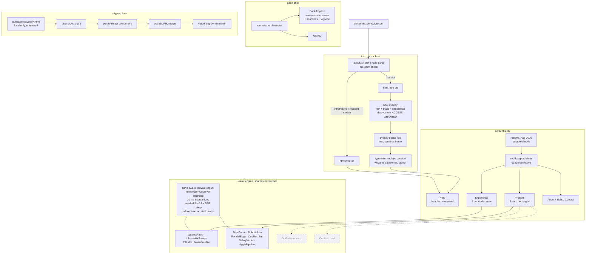

# johnsolon.com · system design

> **How a URL becomes a Matrix boot sequence.** A pre-paint script decides whether you get the cinematic login or the finished terminal. A page-wide rain canvas sets the world. A canonical data file feeds seven sections, and ten hand-rolled canvas visuals animate the actual work: each one waking only when you scroll to it, and each one carrying a designed static frame for reduced motion. Everything ships branch to PR to Vercel.

This is the developer map: every component, built or planned, and how a visit moves through them. The product story and quickstart live in [README.md](README.md).

## Table of Contents

- [End-to-end flowchart](#end-to-end-flowchart)
- [The three flows that matter](#the-three-flows-that-matter)
- [How one visual renders, end to end](#how-one-visual-renders-end-to-end)
- [Subsystem deep dives](#subsystem-deep-dives)
- [Component inventory](#component-inventory)
- [Design decisions](#design-decisions)
- [Build stages](#build-stages)

## End-to-end flowchart

Dashed nodes are planned, not started. The shipping loop is how every visual on the site was built: three throwaway HTML prototypes, one pick, one port, one PR.

## The three flows that matter

1. **First visit.** The inline `<head>` script in `layout.tsx` runs before paint and finds no `introPlayed` flag, so it stamps `html.intro-on`: the page renders with the hero hidden and the boot overlay up. The overlay plays the decryption sequence (skippable at any time), docks itself into the hero terminal's frame, and the typewriter replays the real session. `sessionStorage.introPlayed` is set, so refreshing skips straight to the finished state.

2. **Returning visitor, or reduced motion.** The same pre-paint script stamps `html.intro-off` before the first frame, so there is no flash of the wrong state: the hero renders with the completed terminal session as static content. Under `prefers-reduced-motion`, additionally, the rain never starts, CSS loops are disabled, and every canvas visual draws its designed static frame once instead of animating.

3. **The scroll lifecycle.** Each visual owns a `setInterval` loop that exists only while its wrapper intersects the viewport (threshold 0.1): scroll away and the loop stops, scroll back and it resumes. The backdrop rain listens to `visibilitychange` and pauses on hidden tabs. Nothing on the page animates unseen.

## How one visual renders, end to end

The DualGame card, from server to pixels:

1. **SSR** renders the wrapper div and an empty `<canvas>`: no game state exists on the server, so server and client markup match trivially.
2. **Hydration** runs the effect once: bail out early into a single static draw if `prefers-reduced-motion` matches.
3. **`layout()`** sizes the canvas: CSS pixels from the wrapper, backing store multiplied by `devicePixelRatio` capped at 2, one `setTransform` so all draw code thinks in CSS pixels.
4. **Game state initializes** in closure variables: two ships, bullet array, score, all client-only.
5. **First `render()`** paints immediately so the card is never blank, even before it scrolls into view.
6. **IntersectionObserver** attaches: entering the viewport starts `setInterval(render, 30)`, leaving clears it.
7. **Each tick** advances the simulation (ships wander and dodge, bullets cross the seam, hits explode and score) and repaints the whole frame.
8. **Cleanup** on unmount: stop the interval, disconnect the observer, remove the resize listener.

Every other visual follows the same skeleton with a different simulation inside.

## Subsystem deep dives

### 1. Intro gate and boot state machine

The gate must decide before first paint, so it is an inline blocking script in `layout.tsx` (`<html suppressHydrationWarning>` because the class is set outside React). Inputs: `sessionStorage.introPlayed`, a `?intro=play` override for replays, and `prefers-reduced-motion`. The boot overlay in `Hero.tsx` is a timer-driven sequence (typed boot lines, a scrambling hex decrypt, a progress bar, an ACCESS GRANTED glitch) with a persistent skip control; skip and natural completion converge on the same `dock()` path, which animates the overlay into the hero terminal's frame and hands off to the session typewriter. All timers are tracked and cancelled on unmount or skip.

### 2. Streams-rain backdrop

`Backdrop.tsx` draws the page-wide rain: sparser and calmer than the intro's boot rain, so the world reads as the same place without repeating the movie moment. Implementation: one full-viewport canvas, a column-per-16px grid of falling glyph heads with alpha-fade trails, stepped at roughly 18 fps via an rAF loop with a time gate. Paused on `visibilitychange`, resized on `resize`, skipped entirely under reduced motion (a flat background plus scanline and vignette overlays remain).

### 3. The canvas visual engine

Ten visuals share one skeleton (DPR sizing, IO gating, 30 ms loop, static reduced-motion frame, full cleanup) and differ only in their simulation. Conventions that matter:

- **Seeded randomness for anything SSR-rendered.** Star fields and rack layouts that render as SVG/DOM use `mulberry32` with a fixed seed so hydration matches. Canvas-only state may use `Math.random()` freely because it never renders on the server.
- **Real mechanics over mood.** Each visual simulates the actual system: the DNS walk really walks root to TLD to authoritative and caches the answer; the edge-detection sweep runs a real Sobel convolution on a procedural scene; the arm solves real two-link inverse kinematics with a fixed elbow branch so it cannot flip solutions.
- **HUD numbers are claims.** Anything printed in a visual's HUD (`4,000 particles @ 40Hz`, `100 ms · deterministic`, `launch Sept 2026`) must match the resume, same as body copy.

### 4. Content pipeline

`src/data/portfolio.ts` is the canonical record (experiences, projects, skills, education, contact). The Experience scenes and Project cards additionally carry curated display copy inline in their components, tuned for the page; the rule is that curated copy and canonical data stay in sync, and both defer to the resume when they disagree. This is a deliberate duplication: the data file holds complete resume-grade bullets, the components hold the short cinematic cut.

### 5. Design system

Tokens live in `src/app/globals.css`: near-black background, ink ramp, phosphor greens, hairline, and the iridescent `--iri` gradient with its `.iri` text helper. Bespoke per-section animation CSS lives in scoped `<style>` blocks inside each component, next to the markup it animates. Two hard copy rules: no em dashes anywhere in visible text (en dashes only for date ranges), and mono type (`JetBrains Mono`) marks the machine voice: eyebrows, terminal, HUD labels, chips.

## Component inventory

| Component | Depicts | Accent | Where | Status |
| --- | --- | --- | --- | --- |
| Backdrop | Ambient streams rain + scanlines + vignette | green | `src/components/Backdrop.tsx` | ✅ |
| Hero boot + terminal | Decrypt login, docked zsh session | green | `src/components/new/Hero.tsx` | ✅ |
| QuantaRack | Server racks under burn-in, LED churn | green/amber | `src/components/new/visuals/QuantaRack.tsx` | ✅ |
| UbreakifixScreen | Phone screen swap, crack to clean | green | `src/components/new/visuals/UbreakifixScreen.tsx` | ✅ |
| F1Lidar | Particle-filter localization, LiDAR fan | amber | `src/components/new/visuals/F1Lidar.tsx` | ✅ |
| NasaSatellite | Satellite over Earth, IMU telemetry | cyan/green | `src/components/new/visuals/NasaSatellite.tsx` | ✅ |
| DualGame | Two-screen shooter, bullets cross the seam | green/cyan | `src/components/new/visuals/DualGame.tsx` | ✅ |
| RoboticArm | Serial console + 2-link IK plotter | violet/pink | `src/components/new/visuals/RoboticArm.tsx` | ✅ |
| ParallelEdge | 8-thread row-chunk Sobel sweep | green | `src/components/new/visuals/ParallelEdge.tsx` | ✅ |
| DnsResolver | Recursive walk, cache hit vs miss | blue/cyan | `src/components/new/visuals/DnsResolver.tsx` | ✅ |
| SalaryModel | Neural-net forward pass, salary count-up | amber/pink | `src/components/new/visuals/SalaryModel.tsx` | ✅ |
| AggiePipeline | Postgres to cron to SendGrid reminders | rose | `src/components/new/visuals/AggiePipeline.tsx` | ✅ |
| DraftMaster card | Dota 2 draft simulator visual | tbd | not started | ⬜ |
| Centavo card | Reconcile-or-reject ledger visual | tbd | not started | ⬜ |

## Design decisions

| Decision | Choice | Why |
| --- | --- | --- |
| Scene/card visuals | Hand-rolled canvas, no Lottie/video/GIF | Full control over the simulation (real IK, real Sobel, real DNS walk), tiny payload, one drawing vocabulary across all ten |
| Animation timer | `setInterval(render, 30)` gated by IO, not free-running rAF | Uniform pacing, trivially pausable, and the IO gate makes background cost zero; rAF's tab-throttling behavior varies |
| SSR randomness | Seeded `mulberry32` for anything server-rendered | Identical server/client markup; hydration mismatches were the first bug this repo hit |
| Reduced motion | Designed static frames, not blank boxes | Accessibility without losing the information the visual carries |
| DPR handling | Backing store at `devicePixelRatio` capped at 2 | Retina-crisp lines without paying 3x pixel cost on high-DPR phones |
| Intro gating | Inline pre-paint script + `html` class | The intro decision must precede first paint; anything later flashes the wrong state |
| Styling | Tokens in `globals.css`, bespoke CSS in scoped `<style>` blocks | Section animations live next to their markup; tokens stay global |
| Content | Canonical `portfolio.ts` plus curated inline copy | Data file keeps resume-grade completeness; components keep the cinematic cut; resume wins conflicts |
| Prototyping | 3 standalone HTML files in `public/prototypes/`, untracked | Compare real motion in the browser before committing to a component; deleted after the pick ships |
| Shipping | Branch to PR to merge, never direct to main | Merging main deploys to production via Vercel; PRs keep every visual change reviewable |
| Copy | No em dashes in visible text | House rule: they read as AI-generated |

## Build stages

| Stage | What | Status |
| --- | --- | --- |
| 0 | Light Apple-style redesign (superseded) | ✅ |
| 1 | Dark Neo/Matrix pivot: tokens, backdrop, dark sections | ✅ |
| 2 | Decryption boot intro with pre-paint gate | ✅ |
| 3 | Four Experience scene visuals | ✅ |
| 4 | Six Project card visuals | ✅ |
| 5 | Structural trims: hero dedup, stats band removal, scroll unpin | ✅ |
| 6 | Resume sync: every claim reconciled to the Aug 2026 resume | ✅ |
| 7 | DraftMaster + Centavo cards with bespoke visuals | ⬜ |
| 8 | Copy dedup pass (hero sub, repeated tagline) | ⬜ |
